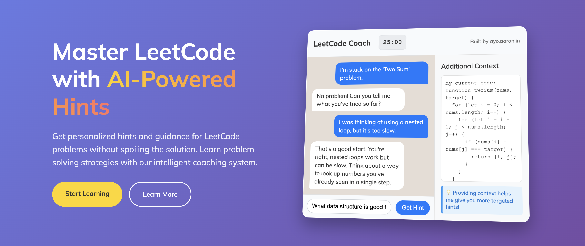

# LeetCode Coach 🤖

**Master LeetCode with AI-Powered Hints**

LeetCode Coach is a web application designed to help you conquer LeetCode problems by providing intelligent, conceptual hints without spoiling the solution. It's the perfect companion for when you're stuck and need a gentle push in the right direction.

 

---

### **Live Demo**

*   **Main App:** `leetcoach.app`
*   **Landing Page:** `leetcoach.app/landing`

---

## ✨ Features

Based on the landing page, the app includes a wide range of features to enhance your learning experience:

*   **🤖 AI-Powered Hints:** Get intelligent, contextual guidance that helps you understand the underlying concepts without giving away the direct answer.
*   **🎯 Personalized Guidance:** Provide context about your current approach or code, and the AI will tailor its hints to your specific situation.
*   **🔄 Multiple Hint System:** If the first hint isn't enough, you can request another one that approaches the problem from a different angle.
*   **⏱️ Built-in Pomodoro Timer:** Stay focused and manage your study sessions effectively with an editable Pomodoro timer right in the header.
*   **🎨 Customizable UI:**
    *   **Dark & Light Mode:** Switch between themes for comfortable coding day or night.
    *   **Floating Code Particles:** An optional, aesthetically pleasing animated background that can be toggled on or off.
*   **🔒 Secure & Private:** All user inputs are sanitized to protect against prompt injection, ensuring your interactions are safe.
*   **🚀 Separate Landing Page:** A beautiful, responsive landing page to showcase the application to new users.

---

## 🛠️ Technologies Used

*   **Backend:** Python (Flask)
*   **Frontend:** HTML, CSS, JavaScript
*   **AI Engine:** Google Gemini API
*   **Deployment:** Waitress, IIS, NSSM, Docker (Coming soon!)

---

## 🚀 Getting Started

Follow these instructions to get the project running on your local machine.

### **Prerequisites**

*   Python 3.x
*   An API key from [Google AI Studio](https://makersuite.google.com/app/apikey)

### **Installation**

1.  **Clone the repository:**
    ```bash
    git clone <your_repo_url>
    cd leetcode-coach
    ```

2.  **Create and activate a virtual environment:**
    ```bash
    # Create
    python3 -m venv venv
    # Activate (macOS/Linux)
    source venv/bin/activate
    # Activate (Windows)
    .\venv\Scripts\activate
    ```

3.  **Install dependencies:**
    ```bash
    pip install -r requirements.txt
    ```

4.  **Set up your environment variables:**
    Create a file named `.env` in the project root and add your Gemini API key.
    ```
    GEMINI_API_KEY=your_actual_gemini_api_key
    ```

### **Running the Application**

1.  **Start the Flask server:**
    ```bash
    flask run
    ```

2.  **Access the app in your browser:**
    *   **Main App:** `http://127.0.0.1:5000/`
    *   **Landing Page:** `http://127.0.0.1:5000/landing`

---

## 🧑‍💻 Built By

This project was built by **ayo.aaronlin**.

*   **Instagram:** [@ayo.aaronlin](https://www.instagram.com/ayo.aaronlin)
*   **Codédex:** [Profile](https://www.codedex.io/?utm_source=aaron&utm_medium=social_media&utm_campaign=ugc_creator_program)

---

## 📜 License

This project is open-source. Feel free to fork, modify, and use it as you see fit.

## ☁️ Deployment

This application is ready for deployment. Here are two recommended strategies:

### **Option 1: Platform-as-a-Service (e.g., Render)**

The repository includes a `render.yaml` file for easy, one-click deployment on [Render](https://render.com).

1.  Push your code to a GitHub repository.
2.  Connect your repo to Render and create a new "Web Service".
3.  Add your `GEMINI_API_KEY` as an environment variable in the Render dashboard.
4.  Render will automatically build and deploy your application using the `render.yaml` configuration.

### **Option 2: Deploying on a VM (Linux/Windows)**

For full control, you can deploy on your own Virtual Machine. Detailed instructions for both **Linux (Ubuntu/Debian)** and **Windows Server** can be found below:

<details>
<summary><b>Click to Expand: Linux VM Deployment Guide (Nginx/WSGI/Systemd)</b></summary>

1.  **Install Packages:**
    ```bash
    sudo apt update
    sudo apt install python3-pip python3-venv nginx git -y
    ```
2.  **Clone Repo & Setup Environment:**
    ```bash
    git clone <your_repo_url> leetcoach && cd leetcoach
    python3 -m venv venv && source venv/bin/activate
    pip install -r requirements.txt
    echo "GEMINI_API_KEY=..." > .env
    ```
3.  **Create Systemd Service:** Create `/etc/systemd/system/leetcoach.service` to manage the application process.
4.  **Configure Nginx:** Set up Nginx as a reverse proxy to forward requests to the WSGI server and serve static files.
5.  **Start Services & Configure Firewall.**

*(For a complete walkthrough, refer to the detailed guide provided in our chat history).*

</details>

<details>
<summary><b>Click to Expand: Windows VM Deployment Guide (Waitress/NSSM)</b></summary>

This guide uses **Waitress** as the WSGI server and **NSSM (the Non-Sucking Service Manager)** to create a reliable Windows Service that runs in the background.

1.  **Prerequisites:**
    *   Install [Python](https://www.python.org/downloads/windows/) (ensure you check "Add Python to PATH").
    *   Install [Git for Windows](https://git-scm.com/download/win).
    *   Download [NSSM](https://nssm.cc/download) and place `nssm.exe` in a PATH directory (e.g., `C:\Windows\System32`).

2.  **Clone Repo & Setup Environment (in PowerShell as Admin):**
    ```powershell
    cd C:\
    git clone <your_repo_url> leetcoach && cd leetcoach
    python -m venv venv
    .\venv\Scripts\activate
    pip install -r requirements.txt
    pip install waitress
    # Create your .env file here
    ```

3.  **Create Windows Service with NSSM:**
    ```powershell
    nssm install leetcoach
    ```
    This opens the NSSM GUI. Configure the following tabs:
    *   **Application Tab:**
        *   **Path:** `C:\leetcoach\venv\Scripts\python.exe`
        *   **Startup directory:** `C:\leetcoach`
        *   **Arguments:** `-m waitress --host 0.0.0.0 --port 80 app:app`
    *   **Environment Tab:**
        *   Add your API key: `GEMINI_API_KEY=your_actual_gemini_api_key`
    *   Click **Install service**.

4.  **Start the Service & Configure Firewall:**
    ```powershell
    nssm start leetcoach
    ```
    *   Open **Windows Defender Firewall** and create a new **Inbound Rule** to allow TCP traffic on **Port 80**.

</details>

---

## 🚌 Project Story: A Bus Ride Build

A significant portion of this project was coded on a bus ride home from New York City. It's a testament to what can be built with focus, a laptop, and a long commute!

Follow the journey and see behind-the-scenes footage on Instagram:

*   **Watch the Reel:** [Building LeetCode Coach on a Bus!](https://www.instagram.com/ayo.aaronlin/reels/) (coming soon!)
*   **Follow on Instagram:** [@ayo.aaronlin](https://www.instagram.com/ayo.aaronlin)

---

## 🧑‍💻 Built By

This project was built by **ayo.aaronlin**.